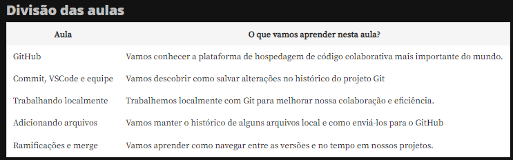

# Git e GitHub

Curso sobre git e github.

## O que foi aprendido durante o curso?

### Aula 1: Conta no GitHub

- **Criamos um repositório com um Readme.**

- **Fizemos um Commit e aprendemos quando é a hora certa de fazer um.**

---

### Aula 2: Commit, VSCode e equipe

- **Acessar o VS Code por meio do GitHub.**

- **Convidar colaborador em um repositório do GitHub.**

- **Verificar o histórico de commits realizados.**

---

### Aula 3: Trabalhando localmente

---

### Aula 4: Adicionando arquivos

---

### Aula 5: Ramificações e merge

---

## Professor e aluno

Professor | Professor | Aluno
:---:     | :---: | :---:
 |  | 
Guilherme Lima | Paulo Silveira |Djoni Bourscheid
